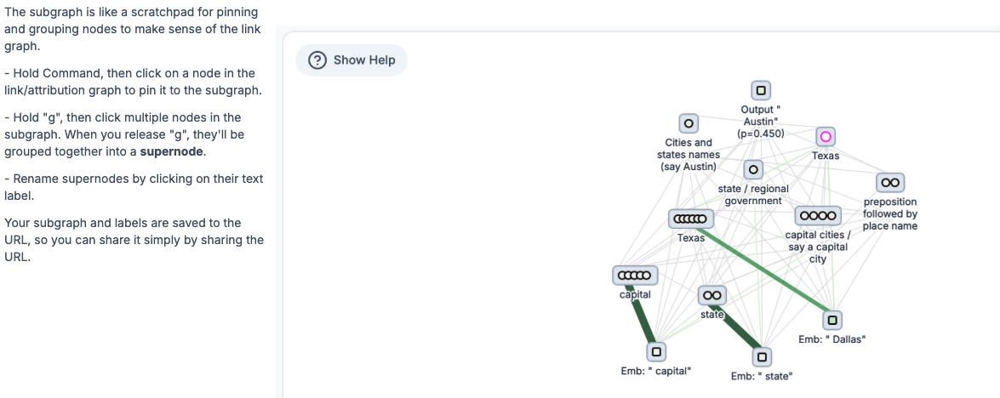

# Anthropic: Tracing the thoughts of a large language model

* [Open-sourcing circuit tracing tools](https://www.anthropic.com/research/open-source-circuit-tracing)
* [Tracing the thoughts of a large language model](https://www.anthropic.com/research/tracing-thoughts-language-model)
* [On the Biology of a Large Language Model](https://transformer-circuits.pub/2025/attribution-graphs/biology.html)
* [safety-research/circuit-tracer](https://github.com/safety-research/circuit-tracer)

## Circuit Tracer

* Anthropic's approach is to generate attribution graphs, which (partially) reveal the stepstaken by a model to decide on a certain output.
* The circuit tracer tool allows:
    * Tracing circuits on supported models, by generating their own attribution graphs;
    * Visualize, annotate, and share graphs in an interactive frontend;
    * Test hypotheses by modifying feature values and observing how model outputs change.
* Currently works on small open-source models, including *Gemma-2-2b* and *Llama-3.2-1b*.

### Visualisation tool

[Circuit Tracer - User Guide](https://www.neuronpedia.org/gemma-2-2b/graph)

