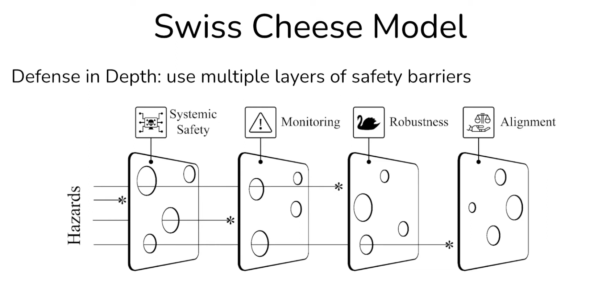
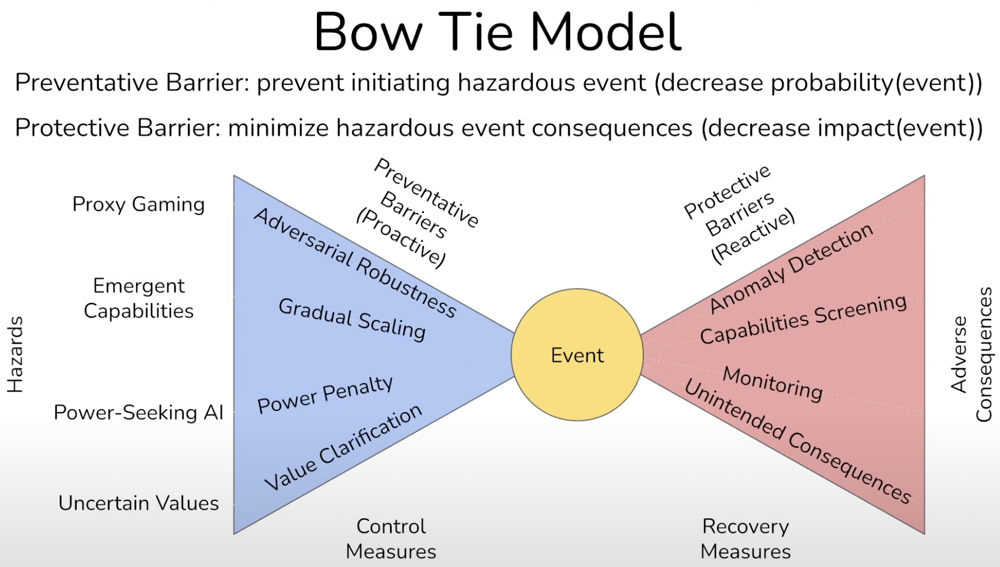

# Intro to ML Safety

## Unit 1: Safety Engineering

### Risk decomposition

* **Risk** = the *probability* of hazard h multiplied by its *impact*, summed over sum over all possible h.
* For each hazard, could also consider how the *vulnerability* and *exposure* interact with the probability and severity.
* In ML:
  * **Alignment** can reduce hazards (minimising their probability and severity within a model).
  * **Robustness** can reduce vulnerability (ability to withstand hazards).
  * **Monitoring** can reduce exposure (by identifying potential hazards).

### Accident models

* **Failure modes and effects analysis**: identification of failures, effects, root causes, and calculation of risk priorities.
* **Swiss cheese model**: multiple layers of safety barriers.

* **Bow tie model**: using both preventative barriers to decrease probability of a hazard and protective barriers to decrease the impact of the hazard.

* Often linear causality is not enough, and hazards are interconnected, circular in causation, and cannot be directly identified or addressed. Hence should look for the collection of factors that are responsible.
